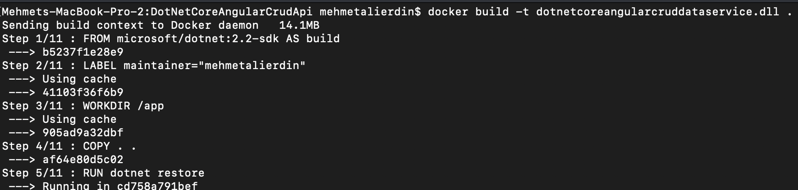

# DotnetCoreAngularDataService

DotnetCoreAngularDataService project is used to get data from json and creates API.

## To Run the project

Note : You can use Postman application to check the api results.

## There are 3 ways to run the API project : 
##	1 - Local run
DotnetCoreAngularDataService.sln contains three .csproj projects. These are DotnetCoreAngularDataService, DotnetCoreAngularDataService.Framework and DotnetCoreAngularDataService.Test. DotnetCoreAngularDataService is the main project that contains controllers and datas(json). DotnetCoreAngularDataService.Framework contains helper, model and service classes. DotnetCoreAngularDataService.Test is the test project which contains the tests.

DotnetCoreAngularDataService should be Startup Project and run it. The application will start over : "http://localhost:5000". The login page's url is "localhost:5000/api/login/" and http method is POST.
		

After authentication is successfull, you can access another API endpoints. There are two types of Endpoints. First endpoint shows all presentations and second one shows a presentation that you mentioned in url. You have to add authorization token that you get from login endpoint to header using "Bearer keyword".

First endpoint is : "localhost:5000/api/data/" -> HTTPGET

Second endpoint is : localhost:5000/api/data/incididunt sint eiusmod labore -> HTTPGET

##	2 - From Docker
DotnetCoreAngularDataService project is dockerized so you can access the endpoints over docker. To run the project over docker you have to follow this steps : 
	- Open CMD and path the project's location. Use the command to build the project : "docker build -t dotnetcoreangularcruddataservice.dll ." This command is going to create image and container.
			

			
After this step is completed, the image id will be generated by docker,

			
Then use the command to run the project : "docker run -p 1881:80 a9d[docker image id]" 
			

			
You can access the API endpoints over docker now :

			
##	3 - From Heroku
DotnetCoreAngularDataService project also contains Heroku integration. To run project from heroku, you have to run this commands after "docker build" step (mentioned above) :

	- docker tag dotnetcoreangularcruddataservice.dll registry.heroku.com/dotnetcoreangulardataservice/web
	- docker push registry.heroku.com/dotnetcoreangulardataservice/web
	- heroku container:release web --app dotnetcoreangulardataservice

Then you can access the endpoints from https://dotnetcoreangulardataservice.herokuapp.com/

				

## Test Project 

Coded using XUnit

