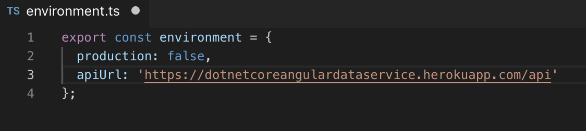

# DotNetCoreAngularCrudWeb

DotNetCoreAngularCrudWeb project lists the data from API and coded with AngularJs

## To Run the project

 - Run `npm install` to get all npm packages used in the project. 

##Important : Before you run this project you have to up Api project

First you have to set the environment url that you will access the endpoints

Then Run `npm start` for a dev server. Navigate to `http://localhost:4200/`. The app will automatically reload if you change any of the source files.

